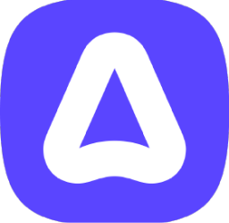

# SimpleIcons
SimpleIcons which you can use anywhere for any purpose for FREE!

# Docs
• [Examples](https://github.com/DrMixxer/SimpleIcons#Examples)

• [Usage](https://github.com/DrMixxer/SimpleIcons#Usage)  

• [Icons](https://github.com/DrMixxer/SimpleIcons#Icons)  

• [Examples](https://github.com/DrMixxer/SimpleIcons#Examples)  


# Examples
You can use SimpleIcons in your github readme, portfolio, website and more.

# Usage

You can specify which icons either via the icon link gen on site which can be found here: 
[Gen](https://)

## Specifying icons Manually 
You can do it like this - by adding the icon id or name after the icontypes=
so like this for example: ```https://example.com/icons?=icontypes=js,ts,css```

## Icon Themes
You can do it like this - by adding theme= (light or dark) 
so like this for example: ```https://example.com/icons?=icontypes=js,ts,css&theme=light```


Or you can do it manually through typing out the link like this: 
[!SimpleIcons](https://websiteexample.com/icons/

# Icons 

#### Icon List

##### NOTE: IM STILL MAKING ICONS SO NOT ALL ARE DONE.

| Icon Name     | Icon ID       | Icon Picture  |
| ------------- | ------------- | ------------- |
|  ableton      |       1       |               |
|  adonisjs     |       2       | |
|  after effects|       3       |   |
|  alpinejs     |       4       |               |
|  androidstudio|       5       |               |
|  angular      |       6       |               |

# 💸 Support SimpleIcons
You can support the SimpleIcons Project by either using the BuyMeACoffee(coming soon) or donating through the SimpleIcons Store.

# 📜 License
We use the GPL v3 license.
What we Allow: 
✅ Usage of icons for personal use(Portfolios, Websites and more) - Must Credit the project/ Add a link
✅ Usage of icons for commercial usage - Must Credit the project / add a link - You cant make a profit on our icons unless you contact me first - NonProfits
✅ Usage of icons for non-profits/charities - Must credit the project / add a link

What we Dont allow: 
❌ Usage of our code - You need to ask first
❌ Usage of our icons for profit or sale 
❌ Using the icons for illegal purposes


